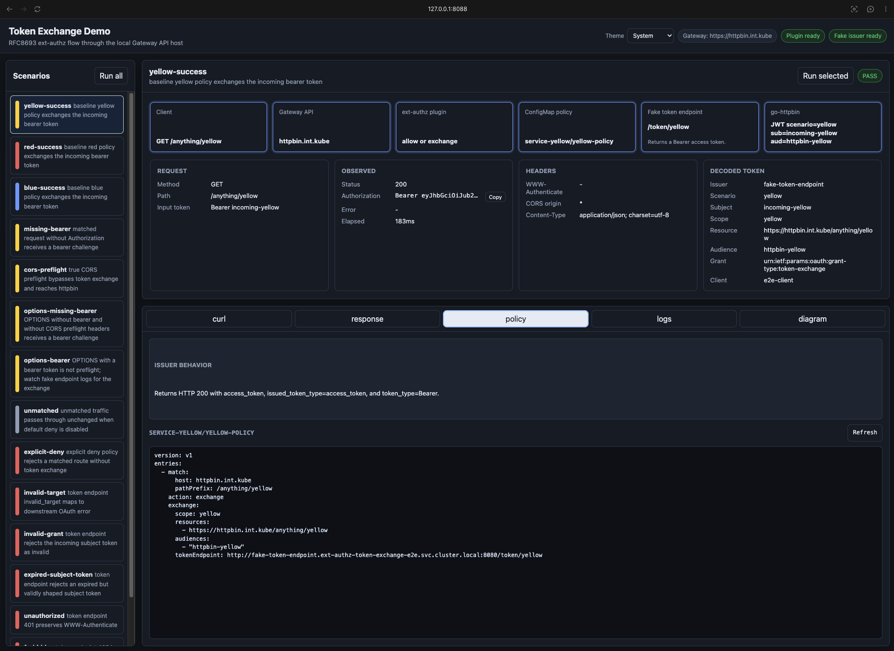
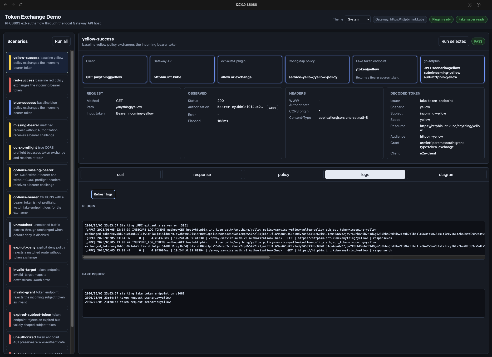
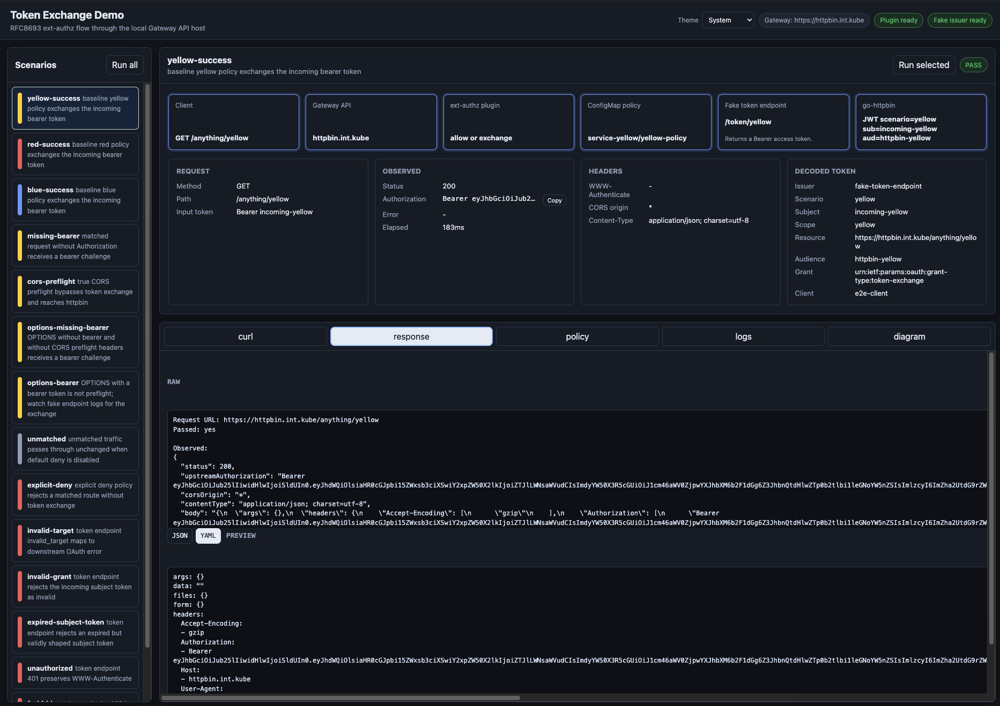
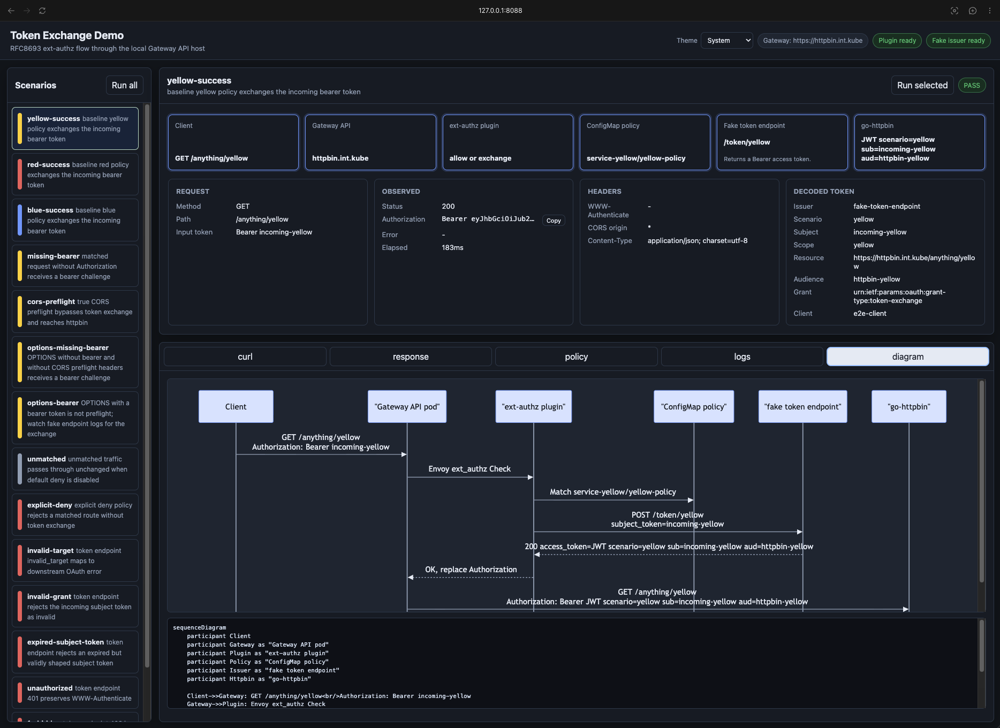

# Ext AuthZ Token Exchange Plugin

Envoy external authorization plugin for OAuth 2.0 token exchange.

The service implements Envoy's ext-authz gRPC API, reads app-owned Kubernetes
ConfigMap policies, performs RFC 8693 token exchange for matched protected
routes, and rewrites the upstream `Authorization` header with the exchanged
access token. Requests that match invalid or ambiguous policy regions fail
closed.

## Project Overview

- `cmd/ext-authz-token-exchange-service/main.go` — gRPC service entrypoint
- `internal/server/` — Envoy ext-authz decisions and responses
- `internal/policy/` — policy parsing, validation, indexing, and matching
- `internal/exchange/` — OAuth token endpoint client behavior
- `internal/config/` — runtime configuration parsing and validation

For a detailed overview, refer to the [Implementation Guide](docs/implementation.md).

## Running the Services

Users who want to run the service **without modifying the code** can use DevSpace directly.

### Running with DevSpace

If you have a local Kubernetes cluster available, [DevSpace](https://devspace.sh/) is all you need.
The default deployment is production-like and deploys only the plugin chart:

For a preview of what gets deployed:

```bash
devspace deploy --render --skip-build
```

If you do not yet have Gateway API CRDs, a cluster-wide gateway named `gateway`, external-dns, cert-manager, etc. installed:

```bash
devspace deploy -p with-infra
```

The command will setup a fully functioning self-contained demo environment.

For the local demo/e2e stack that assumes infrastructure already provides
`https://httpbin.int.kube/` through the Gateway API gateway, use:

```bash
devspace deploy -p local-test
devspace run test-e2e
```

### Demo UI

The local demo includes a browser UI for exercising token exchange scenarios
and inspecting policy, response, log, and request-flow details.



<details>
<summary>More demo screenshots</summary>







</details>

The `local-test` profile deploys the plugin, fake token endpoint, color team
namespaces, and app-owned policy ConfigMaps from the e2e Helm chart. The color
namespaces are labeled with the default policy namespace selector
`ext-authz-token-exchange.magneticflux.net/policy=enabled`; ConfigMaps in
unlabeled namespaces are ignored by the plugin.

By default, requests that do not match any app-owned policy pass through
unchanged. Set `TOKEN_EXCHANGE_DEFAULT_DENY_UNMATCHED=true` or
`tokenExchange.defaultDenyUnmatched=true` in the Helm values to return
`403 Forbidden` for unmatched traffic, including unmatched CORS preflights.
Individual routes can also be rejected with `action: deny` policy entries,
while `action: exchange` keeps the normal token exchange behavior. Policy
entries are split into `match`, `action`, and action-specific configuration:

```yaml
version: v1
entries:
  - match:
      host: api.example.com
      pathPrefix: /orders
      methods: ["GET", "POST"]
    action: exchange
    exchange:
      scope: read:orders
      resources:
        - https://api.example.com/orders
      audiences:
        - orders-api
      tokenEndpoint: https://issuer.example.com/oauth/token

  - match:
      host: api.example.com
      pathPrefix: /admin
      methods: ["*"]
    action: deny
```

Policy ConfigMaps are strictly validated by the running service and
misconfigured matching regions fail closed. Helm schemas validate deployment
values and policies rendered by the e2e chart, while arbitrary app-owned
ConfigMaps can use `docs/policy.schema.json` for editor or CI validation before
they are applied.

Profiles are composable. On a fresh cluster, use `devspace deploy -p with-infra
-p local-test` to install required infrastructure plus the local demo/e2e stack.

Refer to the [DevSpace](docs/devspace.md) and [devspace-starter-pack](https://github.com/michaelw/devspace-starter-pack) documentation
for more information.

### Uninstall

- `devspace purge`, `devspace purge -p with-infra`, `devspace purge -p local-test`, or `devspace purge -p with-infra -p local-test`

## Development Quickstart Guide

This project uses Docker-based devcontainers and a multi-stage Docker build for development.

For further information, refer to the [Development Guide](docs/development.md).

- K8s: `devspace dev`
- gRPC: `GRPC_PORT=3001 go run ./cmd/ext-authz-token-exchange-service`

### Getting Started in VSCode

Deploy a development container and connect it to VSCode

- `devspace dev --vscode`
