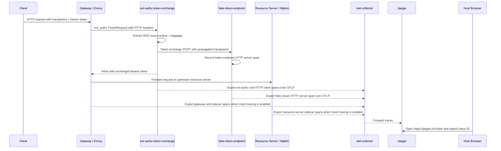
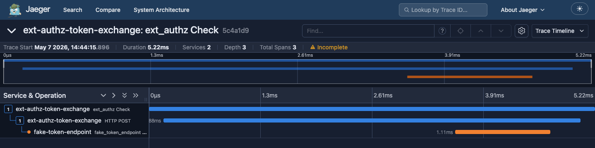
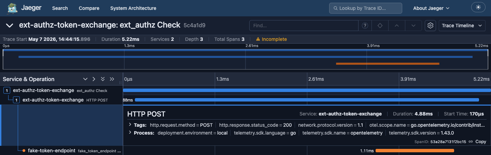
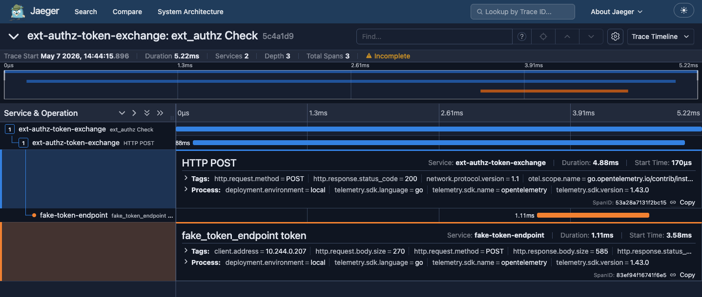

# OpenTelemetry Tracing Tutorial

This tutorial verifies that the ext-authz plugin exports OpenTelemetry traces
for token exchange requests and that the token endpoint subrequest remains in
the same trace as the incoming request. It also describes the optional
full-lifecycle demo, where Istio mesh tracing adds gateway and resource-server
proxy spans and the fake token issuer adds an application server span.

For the complete runtime configuration reference, see
[OpenTelemetry Tracing](configuration.md#opentelemetry-tracing).

## Trace Path

In the local DevSpace environment, the plugin exports OTLP traces to the
cluster-local OpenTelemetry Collector. The collector forwards traces to Jaeger,
and Jaeger is available from the host browser.



The local defaults used by this tutorial are:

- OTLP endpoint: `http://otel-collector.observability.svc.cluster.local:4317`
- Jaeger UI: `https://jaeger.int.kube/`
- Fixed trace ID: `5c4a1d9e8b7340c0a1b2c3d4e5f60718`

Application instrumentation and mesh tracing are complementary:

- Plugin app spans show ext-authz and token exchange behavior.
- Fake issuer app spans show the token endpoint's server-side handling.
- Mesh spans show gateway, sidecar, retry, and resource-server proxy behavior.

A full gateway-to-resource-server trace requires Istio tracing in the local mesh.
Without mesh tracing, Jaeger still shows the plugin and fake issuer application
spans, but it will not show Envoy gateway or resource-server proxy hops.

## Verify Observability

Confirm the OpenTelemetry Collector and Jaeger are running:

```sh
kubectl get pods,svc -n observability
```

The output should include services named `otel-collector` and `jaeger`.

## Enable Plugin Trace Export

The local DevSpace deployment enables plugin trace export by default, so a
redeploy should preserve the plugin `OTEL_*` settings. To verify or patch a
running deployment manually, set the same environment variables with
`kubectl`:

```sh
kubectl -n ext-authz-token-exchange set env deploy/ext-authz-token-exchange \
  OTEL_TRACES_EXPORTER=otlp \
  OTEL_EXPORTER_OTLP_ENDPOINT=http://otel-collector.observability.svc.cluster.local:4317 \
  OTEL_SERVICE_NAME=ext-authz-token-exchange \
  OTEL_RESOURCE_ATTRIBUTES=deployment.environment=local
```

Wait for the rollout to finish:

```sh
kubectl -n ext-authz-token-exchange rollout status deploy/ext-authz-token-exchange
```

These `kubectl set env` commands are live-cluster patches for a one-off
walkthrough. A later Helm or DevSpace deployment can replace them. Keep
persistent local defaults under the `ext-authz-token-exchange` deployment
values in `devspace.yaml`, and keep production defaults in the plugin chart
`env` values.

## Enable Fake Issuer Trace Export

The fake issuer is deployed by the local e2e chart in the
`ext-authz-token-exchange-e2e` namespace. The local DevSpace `local-test`
profile enables its application server span by default. To verify or patch a
running deployment manually, set the same environment variables with
`kubectl`:

```sh
kubectl -n ext-authz-token-exchange-e2e set env deploy/fake-token-endpoint \
  OTEL_TRACES_EXPORTER=otlp \
  OTEL_EXPORTER_OTLP_ENDPOINT=http://otel-collector.observability.svc.cluster.local:4317 \
  OTEL_SERVICE_NAME=fake-token-endpoint \
  OTEL_RESOURCE_ATTRIBUTES=deployment.environment=local
```

Wait for the fake issuer rollout:

```sh
kubectl -n ext-authz-token-exchange-e2e rollout status deploy/fake-token-endpoint
```

For a persistent fake issuer setup, put those keys under
`fakeTokenEndpoint.env` in the e2e chart values or the `local-test` DevSpace
profile values. The same redeploy caveat applies to the disable command below.

If mesh tracing is enabled and you want fewer duplicate spans around the fake
issuer hop, disable fake issuer application tracing while leaving propagation
available elsewhere:

```sh
kubectl -n ext-authz-token-exchange-e2e set env deploy/fake-token-endpoint \
  OTEL_SDK_DISABLED=true
```

## Enable Mesh Tracing For The Full Lifecycle

Use Istio tracing when the demo needs the complete gateway-to-resource-server
shape. Mesh tracing is what adds the gateway, sidecar, and resource-server proxy
spans; the plugin and fake issuer application spans alone cannot report those
proxy hops.

The exact mesh tracing setup belongs to the local infrastructure configuration.
After it is enabled, restart or roll out the gateway and workloads that should
receive tracing configuration, then send a fresh request with a fresh fixed
trace ID.

## Send A Traced Request

Send a request through the local Gateway with a known W3C trace context:

```sh
curl -k https://httpbin.int.kube/anything/yellow \
  -H 'Authorization: Bearer incoming-yellow' \
  -H 'traceparent: 00-5c4a1d9e8b7340c0a1b2c3d4e5f60718-abcdef1234567890-01' \
  -H 'baggage: tenant=yellow'
```

The response should be an HTTP 200 from `httpbin`. The echoed request headers
should show that the upstream request used an exchanged bearer token, not the
original `incoming-yellow` subject token.

This `curl` command supplies the trace parent but does not export a client span.
Use an instrumented client if the demo needs a visible client-side span in
Jaeger.

## Find The Trace In Jaeger

Open [https://jaeger.int.kube/](https://jaeger.int.kube/) in a browser and
search for this trace ID:

```text
5c4a1d9e8b7340c0a1b2c3d4e5f60718
```

Open the matching trace. With the local DevSpace defaults, the trace should
show two services, depth three, and three application spans:
`ext_authz Check`, its child `HTTP POST`, and the fake issuer's child
`fake_token_endpoint token` span. With mesh tracing enabled, it can also include
gateway and resource-server proxy spans in the same trace.



Open the `HTTP POST` span to verify the plugin's token endpoint client request.
It should be a descendant of `ext_authz Check`, not a separate root trace, and
its tags should show `span.kind=client`, `http.request.method=POST`, and the
fake token endpoint service address.



Open the `fake_token_endpoint token` span to verify the issuer's application
server span. It should be a child of the plugin's `HTTP POST` span and should
show `span.kind=server`, `http.response.status_code=200`, and
`deployment.environment=local` in the process tags.



## Troubleshooting

If the trace does not appear in Jaeger:

- Check that the plugin pod has the expected `OTEL_*` variables:
  ```sh
  kubectl -n ext-authz-token-exchange describe deploy/ext-authz-token-exchange
  ```
- Check plugin startup and export errors:
  ```sh
  kubectl logs -n ext-authz-token-exchange deploy/ext-authz-token-exchange
  ```
- Check collector receive/export errors:
  ```sh
  kubectl logs -n observability deploy/otel-collector
  ```
- Check Jaeger availability:
  ```sh
  kubectl logs -n observability deploy/jaeger
  ```
- For full-lifecycle traces, confirm Istio tracing is enabled and the involved
  gateway/workload pods have been rolled after the mesh tracing configuration
  changed.
- Re-send the fixed-trace request after every plugin rollout.
