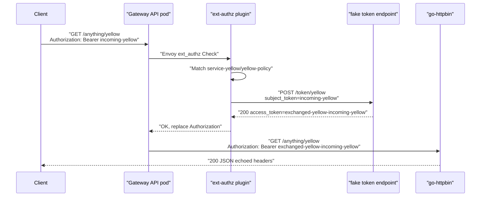
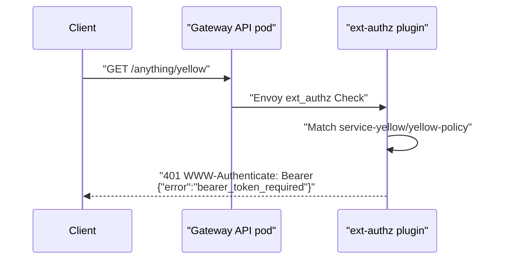
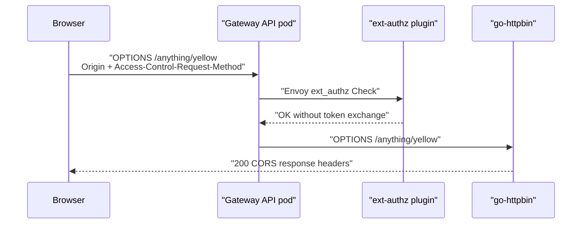
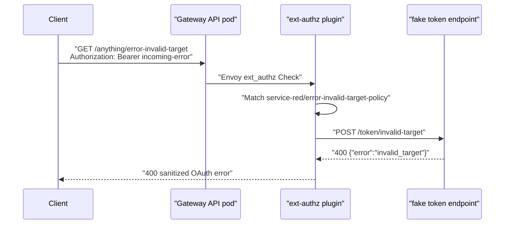
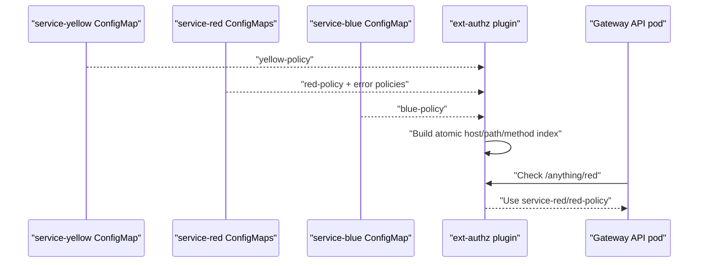
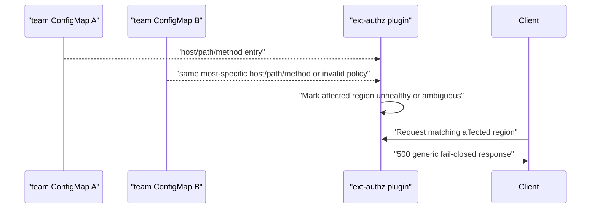

# Kubernetes E2E Tests

These tests assume the local test cluster infrastructure is already installed,
including Istio/Gateway and the shared `mccutchen/go-httpbin` backend reachable
as `https://httpbin.int.kube/` through the Gateway API gateway.

Run the suite only when the cluster and plugin image are available:

```sh
E2E_BASE_URL=https://httpbin.int.kube \
E2E_PLUGIN_IMAGE=ghcr.io/michaelw/ext-authz-token-exchange:latest \
E2E_FAKE_TOKEN_ENDPOINT_IMAGE=ghcr.io/michaelw/ext-authz-token-exchange-fake-token-endpoint:latest \
go run github.com/onsi/ginkgo/v2/ginkgo -r -v ./test/e2e
```

The Ginkgo suite installs `charts/ext-authz-token-exchange-e2e`, an umbrella
Helm chart that deploys the central plugin chart plus demo-only resources. The
test code intentionally does not construct baseline Kubernetes manifests; use
the chart values to change namespaces, credentials, images, policy entries, or
the fake token endpoint.

You can also let DevSpace deploy the full local demo stack:

```sh
devspace deploy -p local-test
devspace run test-e2e
```

`devspace run test-e2e` uses the Ginkgo runner, so repeated runs are not served
from the Go test cache. Pass Ginkgo flags directly, for example
`devspace run test-e2e -v`.

The `local-test` profile builds the plugin and fake token endpoint images, then
deploys the e2e chart. DevSpace updates the image tags in Helm values in memory,
so the local-test flow does not require pushing images to `ghcr.io/michaelw`
when your cluster can use DevSpace-built images.

The production plugin image intentionally contains only
`ext-authz-token-exchange-service`. The fake token endpoint is packaged through
the separate Dockerfile `fake-token-endpoint` target and should be pushed as its
own image.

## Recorded Demo

Use the Go demo runner for a terminal-friendly walkthrough once
`devspace deploy -p local-test` has installed the demo stack. It uses typed HTTP
and JSON handling, and renders `test/e2e/demo-scenarios.yaml` as a Go template:

```sh
go run ./cmd/demo-scenario list
go run ./cmd/demo-scenario yellow-success
go run ./cmd/demo-scenario all
```

To try alternate scenarios or namespace names, pass a different config file or
override the template values:

```sh
go run ./cmd/demo-scenario --config test/e2e/demo-scenarios.yaml --namespace-prefix service all
```

For a browser-recorded walkthrough, start the local dashboard:

```sh
devspace run demo-dashboard
```

Then open `http://127.0.0.1:8088/`. The dashboard is a demo-only binary with
embedded static assets. It is not copied into the production `prod` image; that
image intentionally copies only `ext-authz-token-exchange-service`.

For a recorded demo, a useful four-terminal layout is:

```sh
# 1. Scenario runner.
go run ./cmd/demo-scenario all

# 2. Central plugin logs.
kubectl logs -f -n ext-authz-token-exchange-e2e deploy/ext-authz-token-exchange-e2e

# 3. Fake token endpoint logs.
kubectl logs -f -n ext-authz-token-exchange-e2e deploy/fake-token-endpoint

# 4. App-owned policy watch across namespaces.
kubectl get cm -A -w -l ext-authz-token-exchange.magneticflux.net/enabled=true
```

The runner covers the non-mutating scenarios: yellow/red/blue success, missing
bearer, CORS preflight, plain `OPTIONS` without bearer, `OPTIONS` with bearer,
unmatched pass-through, and token endpoint error responses. The
`expired-subject-token` scenario demonstrates the compatibility-friendly path
where the authorization server returns RFC6749 `invalid_grant` for an expired
but validly shaped subject token, even though RFC8693 points invalid
`subject_token` cases toward `invalid_request`. `go-httpbin` does not echo
request headers in its `OPTIONS` response body, so use the fake token endpoint
log pane to show the `OPTIONS` with bearer exchange. Ginkgo remains the
authoritative runner for mutating fail-closed scenarios such as temporary
cross-namespace conflicts and invalid policy ConfigMaps.

### Successful Token Exchange



### Missing Bearer Challenge



### CORS Preflight Pass-Through



### Token Endpoint Error Mapping



### Multi-Namespace Policy Discovery



### Fail-Closed Policy Regions



By default the suite creates:

- `ext-authz-token-exchange-e2e` for the central ext-authz plugin and fake token endpoint.
- `service-yellow`, `service-red`, and `service-blue` for app-owned policy ConfigMaps.
  These namespaces are labeled
  `ext-authz-token-exchange.magneticflux.net/policy=enabled`, which is the
  plugin's default namespace selector.

The e2e suite also creates an unlabeled `service-black` namespace during one
test and places a valid policy ConfigMap in it. Requests for that policy must
pass through unchanged, proving that ConfigMap labels alone are not enough:
the namespace must match `CONFIGMAP_NAMESPACE_SELECTOR`.

When using `devspace deploy -p local-test`, DevSpace creates or updates the
color namespaces before Helm deploys the demo chart and labels them with the
policy namespace selector. A direct `helm upgrade --install` also labels
namespaces that the chart creates or already owns.

The namespace selector is plugin-side discovery policy. Kubernetes RBAC cannot
grant ConfigMap access by namespace label, so production deployments should
still treat RBAC as the hard access boundary.

Useful overrides:

- `E2E_HOST`: Host header and ConfigMap host. Defaults to the host from `E2E_BASE_URL`.
- `E2E_NAMESPACE_PREFIX`: Prefix for team namespaces. Defaults to `service`.
- `E2E_SYSTEM_NAMESPACE`: Namespace for the plugin and fake token endpoint.
- `E2E_RELEASE`: Helm release name for the plugin.
- `E2E_FAKE_TOKEN_ENDPOINT_IMAGE`: Image for the demo token endpoint.
- `E2E_HTTPBIN_RESOURCE_BASE`: Resource URI base used in demo ConfigMaps.
- `E2E_SKIP_CLEANUP=true`: Keep test namespaces for inspection.
- `E2E_SKIP_INSTALL=true`: Test an already deployed local-test chart release.
- `E2E_INSECURE_SKIP_VERIFY=false`: Enforce TLS verification for the gateway URL.

The suite skips automatically when `E2E_BASE_URL` is not set, so `go test ./...`
remains safe for ordinary unit-test runs.
